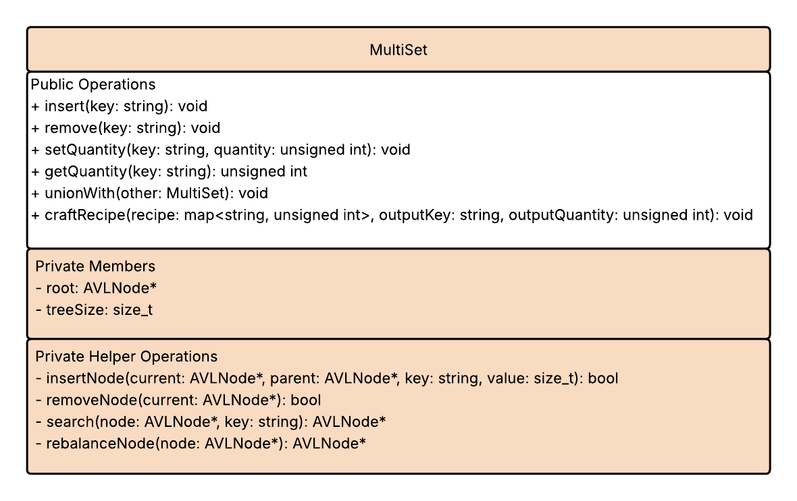

# Project 6 - MultiSet Design Document

# Introduction

## Problem
I am designing a multiset to support a game inventory system. This design is inspired by Minecraft’s stacked-item inventory, where identical items are grouped together and tracked by their name and quantity.

## Solution
My design models a Minecraft inventory system built atop an AVL multiset. Each node in the AVL tree stores a unique item name as a `string` key and its total quantity as an `unsigned int` value.

# Discussion

## Design Philosophy
I am prioritizing Efficiency and Extensibility for Minecraft, its players, and its modding community. Efficiency in this context ensures that inventory operations such as adding, removing, and checking item quantities remains fast even as the number of distinct items grow. Extensibility allows new features, such as crafting, advanced inventory sorting, or other mechanics to be added without modifying the core AVL multiset structure.

AVL trees support efficiency because their height is always balanced, guaranteeing `O(log n)` time for insertions, deletions, and lookups regardless of inventory size. This ensures predictable and efficient performance for all core operations. Extensibility is supported by the ordered structure of the AVL tree which makes it easier to implement future features that rely on sorting, ranges, or set operations like inventory unions without changing the core data structure.

Although AVL trees involve internal balancing, I believe my design may also support simplicity in that each node represents a unique item key and its total quantity without getting into complex game mechanics, such as stack limits or item durability.

## Core Operations

### Insert
The `insert()` operation increases the quantity of an item by `1` using its `string` key. If the key is found, the existing quantity is incremented. If the key is not found, a new node is created in the AVL tree with its quantity initialized to `1`. Adding a new node may require rebalancing if the insertion disrupts the AVL tree’s height balance. The `insert()` operation can be used to add items being picked up, one by one.

#### Time Complexity
The time complexity of the `insert()` operation is `O(log n)` because both searching for the key and any required rebalancing involve traversing the height of the AVL tree, which remains logarithmic relative to the number of nodes. [1, 2]

#### Edge Cases
Edge cases for the `insert()` operation include the triggered rebalancing, inserting many distinct items in rapid succession which increases tree height, and accumulating very large quantities over time which may approach the limits of a player's inventory.

#### Impact
The AVL structure supports the `insert()` operation by maintaining a balanced height, allowing the tree to locate keys and determine whether to increment a quantity or create a new node in `O(log n)` time. Rebalancing ensures long-term performance but introduces additional rotation steps compared to simpler structures. Because the AVL relies on lexicographical ordering of item names, all `insert()` behavior follows that comparison rule, which constrains how items are organized in the tree.

### Remove
The `remove()` operation decreases the quantity of an existing item by `1` using its `string` key. If the key is found and the quantity is greater than `1`, the quantity is simply decremented. If the quantity reaches `0`, the node is removed entirely from the AVL tree. Removing a node may require rebalancing if the deletion disrupts the AVL tree’s height balance. This can be used in Minecraft to drop individual items or to simulate an item like potions or food being consumed.

#### Time Complexity
The time complexity of the `remove()` operation is `O(log n)` because locating the key, performing the deletion, and carrying out any necessary rebalancing all involve traversing the height of the AVL tree, which remains logarithmic relative to the number of nodes. [1, 2]

#### Edge Cases
Edge cases for the `remove()` operation include attempting to remove an item that does not exist in the tree, removing the last remaining quantity of an item which requires deleting its node, and triggering AVL rebalancing when node removal alters subtree heights.

#### Impact
The AVL structure supports the `remove()` operation by guaranteeing balanced height, allowing fast lookup and deletion in `O(log n)` time. Rebalancing maintains long-term efficiency but requires additional rotation steps when nodes are removed. Since AVL trees depend on lexicographical ordering, removal maintains this order even when nodes are deleted, ensuring consistent organization of the remaining items.

### Set Quantity
The `setQuantity` operation assigns a specific quantity to an item using its `string` key. If the key is found, its stored quantity is replaced with the new value. If the new quantity is `0`, the node is removed from the AVL tree. If the key is not found and the new quantity is greater than `0`, a new node is created with that quantity. Creating or removing a node may require rebalancing if the update disrupts the AVL tree’s height balance. My vision for this operation in Minecraft involves using multiple items in crafting or dropping stacks of items.

#### Time Complexity
The time complexity of `setQuantity` is `O(log n)` because locating the key, inserting or deleting a node when necessary, and any required rebalancing all traverse the AVL tree’s height, which is logarithmic relative to the number of nodes. [1, 2]

#### Edge Cases
Edge cases include setting the quantity of a non-existent item (should create a node if the quantity > 0), setting the quantity to `0` (which deletes the node), and assigning extremely large values that could exceed numeric limits.

#### Impact
The AVL structure supports `setQuantity()` by providing balanced, ordered storage so updates and existence checks run in `O(log n)` time. Creating or deleting nodes triggers the same rebalancing logic as insert/remove, preserving performance. Because keys are ordered lexicographically, `setQuantity()` behavior follows the same ordering constraints as other operations.

### Get Quantity
The `getQuantity()` operation retrieves the current quantity of an item using its `string` key. If the key exists in the AVL tree, the operation returns the stored quantity; if the key does not exist, it returns `0` to indicate that the item is not present in the inventory. This may be used in Minecraft to check the amount of an item a player has in their inventory for crafting.

#### Time Complexity
The time complexity of `getQuantity()` is `O(log n)` because the AVL tree allows searching for a key by traversing from the root down to a leaf in logarithmic time relative to the number of nodes. [1, 2]

#### Edge Cases
Edge cases include querying for a key that does not exist (should return `0`), or querying immediately after an insert or remove operation before rebalancing completes.

#### Impact
The AVL structure supports `getQuantity()` efficiently by maintaining a balanced height, allowing the operation to locate any key quickly. The lexicographical ordering of keys does not affect correctness but ensures that all lookups are consistent and predictable.

## Set Operations

### Union
The `union()` operation combines two inventories by summing the quantities of each item. In gameplay, this could be used when a player loots all items from a chest with a hotkey ensuring that all items are accounted for without duplication of keys. Conceptually, the operation iterates over the items in the second inventory and inserts them into the first AVL multiset. If a key already exists, its quantity is incremented by the amount from the other inventory; otherwise, a new node is created. After each insertion, rebalancing may occur to maintain AVL tree balance.

#### Time Complexity
The operation has `O(n log m)` complexity, where `n` is the number of items in the second inventory and `m` is the number of items in the first, because each insertion involves a logarithmic AVL operation. [1, 2]

#### Edge Cases
Edge cases include inventories with completely disjoint sets of items, inventories with extremely large quantities that could exceed storage limits, and empty inventories.

#### Impact
The AVL structure supports the `union()` operation by maintaining fast lookups and insertions for each item in `O(log m)` time, allowing quantities from the second inventory to be combined efficiently. Rebalancing ensures that the combined inventory remains balanced, preserving predictable performance for future operations.

## Extension Feature

### Craft Recipe
The `craftRecipe()` operation allows the player to consume a set of ingredients from their inventory to create a new item. In gameplay, this could model Minecraft’s in-inventory crafting system (e.g. combining four wood planks to create a crafting table or combining coal with sticks to make torches). I think that in-inventory crafting is well within the scope of an inventory built on a multiset but implementing this operation in crafting done on a crafting table could be overstepping some boundaries.

#### Design
This operation would take a recipe (a mapping of required item keys to quantities), the `string` key to the intended item to be crafted, and the quantity of items crafted. Next, it will check if the player’s inventory contains enough of each ingredient. If so, it decrements the quantities for each ingredient in the AVL multiset and adds the crafted item as a new node (or increments its quantity if it already exists). Rebalancing occurs as necessary after insertions or deletions.

    function craftRecipe(recipe, resultItem, resultQty)
        // Check if all ingredients are available
        for each (item, reqQty) in recipe
            if getQuantity(item) < reqQty
                return false  // Not enough ingredients
    
        // Consume ingredients
        for each (item, reqQty) in recipe
            setQuantity(item, getQuantity(item) - reqQty)
    
        // Add crafted output
        setQuantity(resultItem, getQuantity(resultItem) + resultQty)
    
        return true

#### Time Complexity
Checking and updating all ingredients requires `O(r log n)` time, where `r` is the number of items in the recipe and `n` is the number of distinct items in the inventory. Each lookup, decrement, or insertion is `O(log n)` due to AVL operations. [1, 2]

#### Edge Cases
Edge cases include insufficient ingredients to craft the recipe, recipes that create items already at maximum stack limits, and invalid recipes (nonexistent or malformed ingredient lists).

#### Impact
This feature directly integrates the multiset with core gameplay mechanics, making the inventory a dynamic tool for crafting. The AVL tree ensures predictable performance when checking ingredient quantities and updating the inventory after crafting.

## Multiset UML Diagram

## Trade-off Analysis
For this inventory system, I chose an AVL tree for the multiset instead of a hash table. Hash tables provide fast average-case `O(1)` insert and lookup times, but they do not maintain key ordering, which makes sorted operations, range queries, and set-like behaviors harder to implement [2]. They also require resizing and can degrade to `O(n)` performance in the worst case. The AVL tree avoids these issues by guaranteeing `O(log n)` performance for all core operations while keeping elements ordered and balanced. Although AVL trees involve more implementation complexity due to rebalancing, their predictable performance and built-in ordering make them the more suitable choice. [1]

Another reason why I chose an AVL tree for Minecraft's inventory system is to easily implement built-in lexicographical sorting in-game. I have always wanted a sort inventory button in the base game, and although alphabetical order is not my desired sorted style, as I prefer items to be sorted near related or similar items (e.g. blocks with blocks and tools with tools), it is still a great option to have.

| Data Structure | Advantages                                                                                           | Disadvantages                                                                                            | Key Operation Complexity                                                                                                    |
| -------------- |------------------------------------------------------------------------------------------------------|----------------------------------------------------------------------------------------------------------|-----------------------------------------------------------------------------------------------------------------------------|
| AVL Tree       | Maintains sorted order; predictable `O(log n)` performance; supports range and set operations [1, 2] | Slightly more complex implementation; rotations required for rebalancing [2]                             | Insert: `O(log n)`   Remove: `O(log n)`   Search: `O(log n)`   [1, 2]                                           |
| Hash Table     | Very fast average-case insert/lookup `O(1)`; simple conceptual model [1, 2]                          | No inherent ordering; worst-case `O(n)`; resizing required; harder to implement range/set operations [2] | Insert: `O(1)` avg, `O(n)` worst   Remove: `O(1)` avg, `O(n)` worst   Search: `O(1)` avg, `O(n)` worst   [1, 2] |

## Alternative Design Sketch
If the inventory were built on a hash table instead of an AVL tree, inserts, lookups, and crafting checks would use constant-time bucket access rather than ordered traversal. The structure would be simpler since no balancing or height maintenance is required. However, any feature that depends on sorted keys, such as lexicographic displays, range queries, or producing consistently ordered ingredient lists, would require manually collecting and sorting keys, since a hash table provides no inherent ordering.

## Evaluation Plan
To test the MultiSet design, I would use unit tests that verify all core operations (`insert()`, `remove()`, `getQuantity()`, and `union()`) including edge cases like duplicate inserts, removing to zero, empty inventories, and nonexistent keys. I would also confirm AVL correctness by checking balance factors and ensuring that in-order traversal always produces sorted keys.

The `craftRecipe()` feature would be tested with valid recipes, missing ingredient cases, and inventories lacking required keys to ensure quantities update correctly and crafted items are added as expected.

Performance would be evaluated by timing operations on increasingly large inventories to confirm logarithmic behavior, as well as testing with randomized inserts and deletes.

To evaluate extensibility and maintainability, I would test whether new operations or recipes can be added without changing existing code. A robust design shows clear separation of responsibilities, minimal repeated logic, and ensures existing features continue to work correctly when new features are introduced.

# Conclusion
This multiset design models a Minecraft inventory using an AVL tree, providing efficient `O(log n)` operations for adding, removing, setting, and retrieving item quantities. Lexicographical ordering and rebalancing ensure consistent organization and support set operations like `union()` and features like `craftRecipe()`.

The main trade-off is accepting the extra complexity of AVL rotations for guaranteed ordering and balanced performance, compared to simpler structures like hash tables. Future improvements could include custom sorting of related item groups or handling, sure-proofing max inventory is never exceeded, and adding more core functions like `isEmpty()`.

The design demonstrates abstraction by exposing only high-level inventory operations, encapsulation by hiding node and balancing details, and composition by building features like crafting on top of the core AVL multiset. These principles make the system modular, maintainable, and extensible for new inventory mechanics.

# Sources
[1] S. Jain, “Time complexities of different data structures,” GeeksforGeeks, https://www.geeksforgeeks.org/dsa/time-complexities-of-different-data-structures/ (accessed Dec. 5, 2025).
[2] “Advantages of BST over hash table,” GeeksforGeeks, https://www.geeksforgeeks.org/dsa/advantages-of-bst-over-hash-table/ (accessed Dec. 5, 2025).